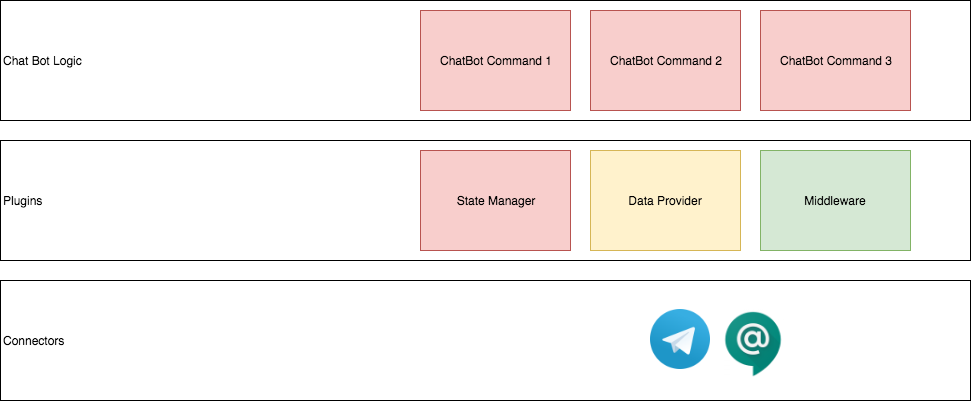

[](https://www.codacy.com/manual/soroosh.sarabadani/chatbot-core?utm_source=github.com&amp;utm_medium=referral&amp;utm_content=psycho-ir/chatbot-core&amp;utm_campaign=Badge_Grade)

Chatbot
=======

A framework to build chatbot compatible with different platforms!
The idea is simple, develop chatbots in the same way do implement web applications via Spring Web.

A simple Example:

## How to implement a chatbot that echo the message:
```java
@Service
@ChatController
public class MessageEchoExample {

    @OnCommand("echo")
    public Response onEchoCommand(String message, Context context) {
        return () -> "echo " + message;
    }
    ...
}
```



## Milestones
Below are some ideas I'll implement in the comming days, no promise to respect the order though!

- [ ]  Design chatbot connector ready to implement for different platforms
- [ ]  Telegram Chatbot connector 
- [ ]  Google chat Chatbot connector 
- [ ]  Slack chatbot connector
- [ ]  Design plugin to make the chatbot extensible
- [ ]  Some plugins out of the box
